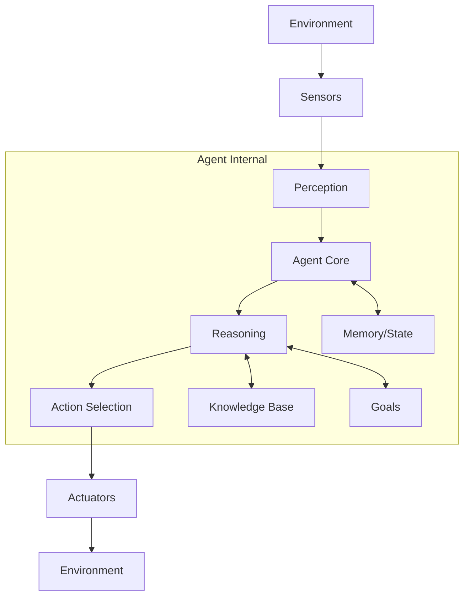

# Lesson 03: Basic Agent Architecture

## 🎯 Learning Objectives

By the end of this lesson, you will be able to:

- Understand the fundamental components of agent architecture
- Design agents using different architectural patterns
- Implement state management and memory systems
- Create modular and extensible agent designs
- Apply separation of concerns principles to agent development

## 📚 Prerequisites

- Completion of Lessons 01 and 02
- Understanding of object-oriented programming
- Basic knowledge of design patterns
- Familiarity with Python async/await

## 🏗️ Agent Architecture Fundamentals

### Core Components

Every intelligent agent consists of these essential components:



1. **Sensors**: Input interfaces that perceive the environment
2. **Perception**: Processing and interpreting sensory data
3. **Agent Core**: Central decision-making component
4. **Memory/State**: Information storage and retrieval
5. **Reasoning**: Logic and inference mechanisms
6. **Action Selection**: Choosing appropriate responses
7. **Actuators**: Output interfaces that affect the environment

### Agent Types Revisited

#### Reactive Agents

```python
from adk_course import Agent, AgentConfig
from typing import Dict, Any

class ReactiveAgent(Agent):
    """Simple reactive agent that responds to immediate inputs."""
    
    def __init__(self, config: AgentConfig):
        super().__init__(config)
        self.rules = {
            "greeting": "Hello! How can I help you?",
            "goodbye": "Goodbye! Have a great day!",
            "question": "That's an interesting question. Let me think...",
        }
    
    async def process_message(self, message: str, context: Dict[str, Any] = None) -> str:
        """Process message using simple rule-based responses."""
        message_lower = message.lower()
        
        if any(word in message_lower for word in ["hello", "hi", "hey"]):
            return self.rules["greeting"]
        elif any(word in message_lower for word in ["bye", "goodbye", "farewell"]):
            return self.rules["goodbye"]
        elif "?" in message:
            return self.rules["question"]
        else:
            return f"I received your message: {message}"
```

#### Model-Based Agents

```python
from dataclasses import dataclass
from datetime import datetime
from typing import List, Optional

@dataclass
class WorldState:
    """Represents the agent's understanding of the world."""
    current_conversation: List[str]
    user_preferences: Dict[str, Any]
    conversation_context: str
    last_interaction: datetime
    user_mood: Optional[str] = None

class ModelBasedAgent(Agent):
    """Agent that maintains an internal model of the world."""
    
    def __init__(self, config: AgentConfig):
        super().__init__(config)
        self.world_state = WorldState(
            current_conversation=[],
            user_preferences={},
            conversation_context="general",
            last_interaction=datetime.utcnow()
        )
    
    async def process_message(self, message: str, context: Dict[str, Any] = None) -> str:
        """Process message considering internal world model."""
        # Update world state
        self.world_state.current_conversation.append(message)
        self.world_state.last_interaction = datetime.utcnow()
        
        # Analyze context
        await self._analyze_context(message)
        
        # Generate response based on world state
        response = await self._generate_contextual_response(message)
        
        # Update state with response
        self.world_state.current_conversation.append(response)
        
        return response
    
    async def _analyze_context(self, message: str):
        """Analyze message and update world state."""
        # Detect user mood
        if any(word in message.lower() for word in ["sad", "upset", "angry"]):
            self.world_state.user_mood = "negative"
        elif any(word in message.lower() for word in ["happy", "great", "awesome"]):
            self.world_state.user_mood = "positive"
        
        # Update preferences based on conversation
        if "prefer" in message.lower():
            # Extract preferences (simplified)
            self.world_state.user_preferences["last_preference"] = message
    
    async def _generate_contextual_response(self, message: str) -> str:
        """Generate response considering world state."""
        if self.world_state.user_mood == "negative":
            return f"I understand you might be feeling down. How can I help with: {message}"
        elif self.world_state.user_mood == "positive":
            return f"Great to hear you're in a good mood! About '{message}', I'd say..."
        else:
            return f"Regarding '{message}', based on our conversation so far..."
```

## 🧠 Memory Systems

### Short-term Memory

```python
from collections import deque
from typing import Deque

class ShortTermMemory:
    """Manages recent interactions and immediate context."""
    
    def __init__(self, max_size: int = 10):
        self.messages: Deque[str] = deque(maxlen=max_size)
        self.context: Dict[str, Any] = {}
    
    def add_message(self, message: str, role: str = "user"):
        """Add a message to short-term memory."""
        self.messages.append(f"{role}: {message}")
    
    def get_recent_context(self, limit: int = 5) -> str:
        """Get recent conversation context."""
        recent = list(self.messages)[-limit:]
        return "\n".join(recent)
    
    def clear(self):
        """Clear short-term memory."""
        self.messages.clear()
        self.context.clear()
```

### Long-term Memory

```python
from pathlib import Path
import json
from typing import Any, Dict, List

class LongTermMemory:
    """Manages persistent knowledge and learned information."""
    
    def __init__(self, storage_path: Path):
        self.storage_path = storage_path
        self.storage_path.mkdir(parents=True, exist_ok=True)
        self.knowledge_base = self._load_knowledge()
    
    def _load_knowledge(self) -> Dict[str, Any]:
        """Load knowledge from persistent storage."""
        kb_file = self.storage_path / "knowledge_base.json"
        if kb_file.exists():
            return json.loads(kb_file.read_text())
        return {"facts": {}, "patterns": {}, "preferences": {}}
    
    def _save_knowledge(self):
        """Save knowledge to persistent storage."""
        kb_file = self.storage_path / "knowledge_base.json"
        kb_file.write_text(json.dumps(self.knowledge_base, indent=2))
    
    def store_fact(self, key: str, value: Any):
        """Store a fact in long-term memory."""
        self.knowledge_base["facts"][key] = value
        self._save_knowledge()
    
    def get_fact(self, key: str) -> Any:
        """Retrieve a fact from long-term memory."""
        return self.knowledge_base["facts"].get(key)
    
    def store_pattern(self, pattern: str, response: str):
        """Store a learned pattern-response pair."""
        self.knowledge_base["patterns"][pattern] = response
        self._save_knowledge()
    
    def find_matching_patterns(self, text: str) -> List[str]:
        """Find patterns that match the given text."""
        matches = []
        for pattern in self.knowledge_base["patterns"]:
            if pattern.lower() in text.lower():
                matches.append(self.knowledge_base["patterns"][pattern])
        return matches
```

## 🏛️ Modular Agent Architecture

### Component-Based Design

```python
from abc import ABC, abstractmethod
from typing import Protocol

class AgentComponent(ABC):
    """Base class for all agent components."""
    
    @abstractmethod
    async def initialize(self) -> None:
        """Initialize the component."""
        pass
    
    @abstractmethod
    async def process(self, data: Any) -> Any:
        """Process data through this component."""
        pass

class PerceptionModule(AgentComponent):
    """Handles input perception and preprocessing."""
    
    async def initialize(self) -> None:
        """Initialize perception module."""
        self.filters = []
        self.preprocessors = []
    
    async def process(self, raw_input: str) -> Dict[str, Any]:
        """Process raw input into structured data."""
        return {
            "text": raw_input.strip(),
            "length": len(raw_input),
            "intent": await self._detect_intent(raw_input),
            "entities": await self._extract_entities(raw_input),
        }
    
    async def _detect_intent(self, text: str) -> str:
        """Detect user intent from text."""
        # Simplified intent detection
        if "?" in text:
            return "question"
        elif any(word in text.lower() for word in ["hello", "hi"]):
            return "greeting"
        else:
            return "statement"
    
    async def _extract_entities(self, text: str) -> List[str]:
        """Extract entities from text."""
        # Simplified entity extraction
        entities = []
        words = text.split()
        for word in words:
            if word.startswith("@"):  # Username
                entities.append(("username", word[1:]))
            elif word.startswith("#"):  # Hashtag
                entities.append(("hashtag", word[1:]))
        return entities

class ReasoningModule(AgentComponent):
    """Handles decision making and reasoning."""
    
    def __init__(self, knowledge_base: LongTermMemory):
        self.knowledge_base = knowledge_base
        self.rules = []
    
    async def initialize(self) -> None:
        """Initialize reasoning module."""
        self.rules = [
            ("question_intent", self._handle_question),
            ("greeting_intent", self._handle_greeting),
            ("default", self._handle_default),
        ]
    
    async def process(self, perception_data: Dict[str, Any]) -> Dict[str, Any]:
        """Reason about the perceived data and decide on actions."""
        intent = perception_data["intent"]
        
        # Find matching rule
        for rule_name, rule_func in self.rules:
            if rule_name == f"{intent}_intent" or rule_name == "default":
                action = await rule_func(perception_data)
                return {
                    "action_type": action["type"],
                    "action_params": action["params"],
                    "confidence": action.get("confidence", 0.8),
                }
        
        return {"action_type": "no_action", "action_params": {}, "confidence": 0.0}
    
    async def _handle_question(self, data: Dict[str, Any]) -> Dict[str, Any]:
        """Handle question intent."""
        return {
            "type": "respond",
            "params": {"response_type": "informative"},
            "confidence": 0.9
        }
    
    async def _handle_greeting(self, data: Dict[str, Any]) -> Dict[str, Any]:
        """Handle greeting intent."""
        return {
            "type": "respond", 
            "params": {"response_type": "greeting"},
            "confidence": 0.95
        }
    
    async def _handle_default(self, data: Dict[str, Any]) -> Dict[str, Any]:
        """Handle default case."""
        return {
            "type": "respond",
            "params": {"response_type": "acknowledgment"},
            "confidence": 0.6
        }

class ActionModule(AgentComponent):
    """Handles action execution and output generation."""
    
    async def initialize(self) -> None:
        """Initialize action module."""
        self.response_templates = {
            "informative": "That's an interesting question about {topic}. Let me help...",
            "greeting": "Hello! How can I assist you today?",
            "acknowledgment": "I understand. Could you provide more details?",
        }
    
    async def process(self, reasoning_output: Dict[str, Any]) -> str:
        """Execute action based on reasoning output."""
        action_type = reasoning_output["action_type"]
        action_params = reasoning_output["action_params"]
        
        if action_type == "respond":
            return await self._generate_response(action_params)
        else:
            return "I'm not sure how to respond to that."
    
    async def _generate_response(self, params: Dict[str, Any]) -> str:
        """Generate a response based on parameters."""
        response_type = params.get("response_type", "acknowledgment")
        template = self.response_templates.get(response_type, "I understand.")
        
        # Simple template filling (in practice, use more sophisticated NLG)
        if "{topic}" in template:
            template = template.replace("{topic}", params.get("topic", "your request"))
        
        return template
```

### Modular Agent Implementation

```python
class ModularAgent(Agent):
    """Agent built with modular architecture."""
    
    def __init__(self, config: AgentConfig):
        super().__init__(config)
        
        # Initialize components
        self.short_term_memory = ShortTermMemory()
        self.long_term_memory = LongTermMemory(Path("./agent_memory"))
        
        self.perception = PerceptionModule()
        self.reasoning = ReasoningModule(self.long_term_memory)
        self.action = ActionModule()
        
        # Component initialization will be done in async context
        self._initialized = False
    
    async def _ensure_initialized(self):
        """Ensure all components are initialized."""
        if not self._initialized:
            await self.perception.initialize()
            await self.reasoning.initialize()
            await self.action.initialize()
            self._initialized = True
    
    async def process_message(self, message: str, context: Dict[str, Any] = None) -> str:
        """Process message through modular architecture."""
        await self._ensure_initialized()
        
        # Store in short-term memory
        self.short_term_memory.add_message(message, "user")
        
        # Process through components
        try:
            # Perception
            perception_data = await self.perception.process(message)
            
            # Add conversation context
            perception_data["context"] = self.short_term_memory.get_recent_context()
            
            # Reasoning
            reasoning_output = await self.reasoning.process(perception_data)
            
            # Action
            response = await self.action.process(reasoning_output)
            
            # Store response in memory
            self.short_term_memory.add_message(response, "assistant")
            
            return response
            
        except Exception as e:
            logger.error(f"Error processing message: {e}")
            return "I apologize, but I encountered an error processing your request."
```

## 🎯 Exercises

### Exercise 1: Implement a Goal-Based Agent

Create an agent that works toward specific goals:

```python
@dataclass
class Goal:
    name: str
    description: str
    priority: int
    completed: bool = False
    progress: float = 0.0

class GoalBasedAgent(Agent):
    def __init__(self, config: AgentConfig):
        super().__init__(config)
        self.goals = []
    
    def add_goal(self, goal: Goal):
        """Add a goal to the agent."""
        # Implement this method
        pass
    
    async def process_message(self, message: str, context: Dict[str, Any] = None) -> str:
        """Process message while considering current goals."""
        # Implement goal-oriented processing
        pass
```

### Exercise 2: Create a Learning Agent

Implement an agent that improves over time:

```python
class LearningAgent(Agent):
    def __init__(self, config: AgentConfig):
        super().__init__(config)
        self.performance_history = []
        self.learning_rate = 0.1
    
    async def learn_from_feedback(self, message: str, response: str, feedback: str):
        """Learn from user feedback."""
        # Implement learning mechanism
        pass
    
    async def adapt_behavior(self):
        """Adapt behavior based on learning."""
        # Implement adaptation logic
        pass
```

### Exercise 3: Multi-Agent Communication

Design a system where multiple agents can communicate:

```python
class AgentCommunicationProtocol:
    def __init__(self):
        self.agents = {}
        self.message_queue = []
    
    def register_agent(self, agent_id: str, agent: Agent):
        """Register an agent in the communication system."""
        pass
    
    async def send_message(self, from_agent: str, to_agent: str, message: str):
        """Send message between agents."""
        pass
    
    async def broadcast_message(self, from_agent: str, message: str):
        """Broadcast message to all agents."""
        pass
```

## 📚 Additional Resources

### Architecture Patterns
- [Agent-Oriented Programming](https://en.wikipedia.org/wiki/Agent-oriented_programming)
- [Microservices Architecture](https://microservices.io/)
- [SOLID Principles](https://en.wikipedia.org/wiki/SOLID)

### Memory Systems
- [Cognitive Architectures](https://en.wikipedia.org/wiki/Cognitive_architecture)
- [Memory Management in AI](https://www.ai-journal.com/memory-management)

### Design Patterns
- [Gang of Four Design Patterns](https://refactoring.guru/design-patterns)
- [Python Design Patterns](https://python-patterns.guide/)

## ✅ Lesson Checklist

- [ ] Understanding of agent architecture components
- [ ] Implementation of different agent types (reactive, model-based)
- [ ] Memory system design (short-term and long-term)
- [ ] Modular architecture with components
- [ ] Goal-based agent implementation
- [ ] Learning agent concepts
- [ ] Multi-agent communication basics
- [ ] Exercises completed
- [ ] Ready for Lesson 04

---

**Estimated Time**: 2-3 hours  
**Difficulty**: Intermediate  
**Prerequisites**: Lessons 01-02, OOP knowledge